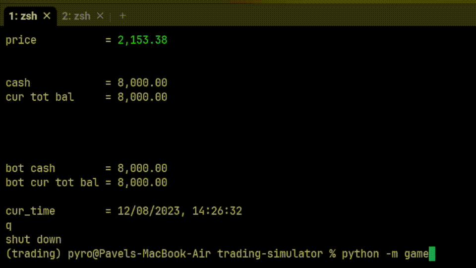

# trading-simulator

A simple game to play and train trading skills with a bot

# CLI example of this game

## How to run
1. Clone repository
2. Install dependencies in requirements.txt or environment.yml
3. `python -m game`

## What can be done to make it even more joyful
- [ ] Improve bot performance
- [ ] Add matplotlib window (using tkinter) with history of stock price
- [ ] Write JS frontend
- [ ] Refactor classes, add more documentation

## Motivation
To practice advices from the book [Practices of the Python Pro](https://www.manning.com/books/practices-of-the-python-pro)

## Class diagram to understand how classes are related
